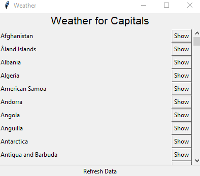

# CapiWeather 🌎🌧
## Contents
- [About CapiWeather](#about)
- [APIs Used](#apis)
- [How to Run CapiWeather](#how-to-run-capiweather)
- [Creating an .EXE](#how-to-create-an-exe-file)

## About
CapiWeather simple Weather GUI which combines various data on a Country's Capital, and it's current Weather, using Tkinter, Threading, and Requests



## APIs

This program uses:
- [REST countries](https://restcountries.eu/) to obtain data on all the countries and their capitals
- [Weather Stack](https://weatherstack.com/) for their detailed weather data

## How to run CapiWeather
First, if you haven't already, [Install Pipenv](https://pipenv-fork.readthedocs.io/en/latest/)

### Creating a new Pipenv
```
pipenv shell
``` 

### Installing Dependencies
```
pipenv install
```
This will install all dependencies from the Pipfile

### Setting up Environment Variables
Go to [`.env.example`](.env.example), and place your API Key from [Weather Stack](https://weatherstack.com/)
```
API_KEY="place_key_here"
``` 
Then, Rename the file to `.env`

### Running the program
```
pipenv run app.py
```

## How to create an .EXE file
After creating the pipenv shell, creating the `.env` file, and installing all dependencies run:
```
pipenv run pyinstaller app.spec
```
This will create a new folder inside `dist`, containing the .exe and it's required files, afte
